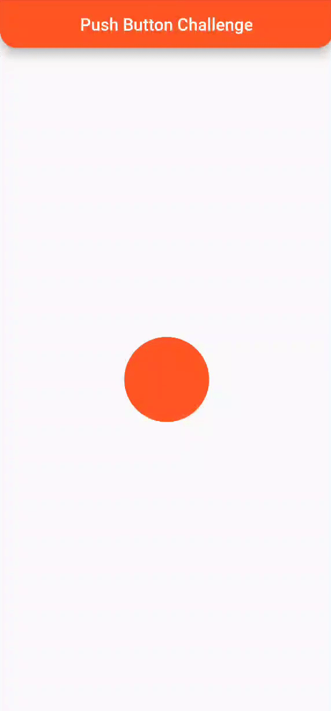

# Push Button Challenge

a project for solving [DanialMoj co](https://www.danialmoj.com/) challenge

## Preview

## Getting Started

No external dependencies needed. Just pull the code from the repository and run it.

## Resources that helped me

- a medium article
  on [Ripple animation in Flutter](https://medium.flutterdevs.com/ripple-animation-in-flutter-3421cbd66a18)